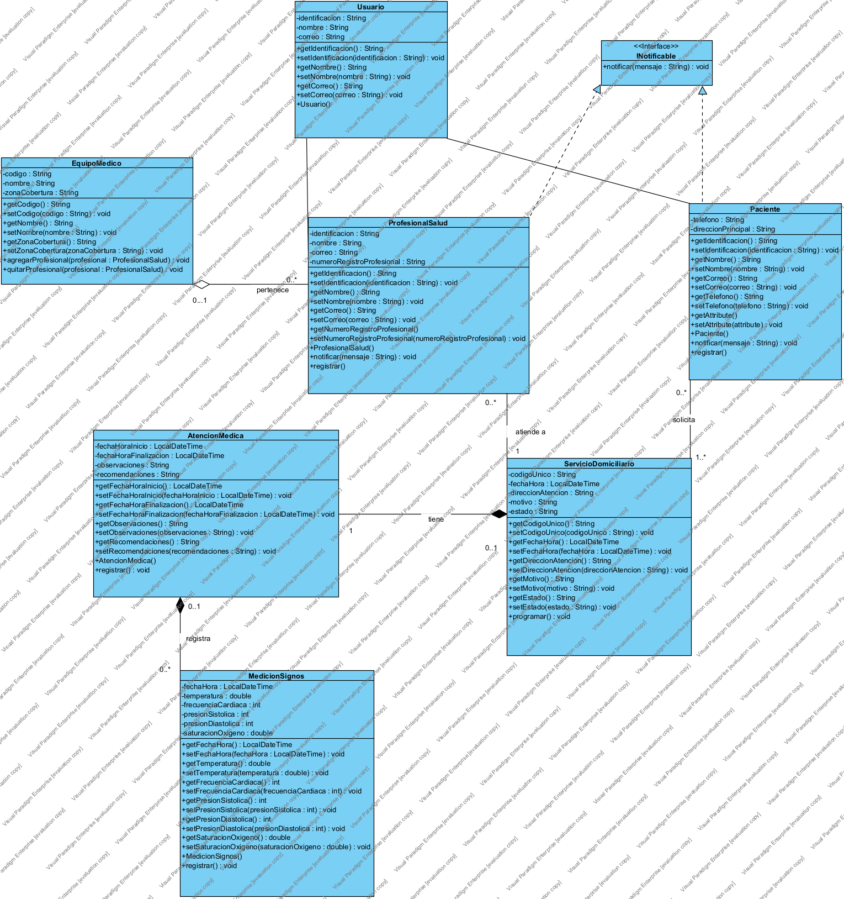

# Taller – Diseño de Software: MediHome App

**Autor:** Stheban Danilo Hoyos Villota

> **Nota:** La actividad del diagrama de clases la realicé solo, de forma independiente.

Sistema de atención médica domiciliaria desarrollado en **Java** a partir del diagrama de clases UML diseñado en Visual Paradigm. Incluye el diagrama, el archivo fuente del modelo y una aplicación de consola (con menú interactivo) que implementa las 8 clases y todas sus relaciones.

---

## Diagrama de clases



- **Imagen:** [`diagrama-clases.png`](diagrama-clases.png)
- **Archivo fuente de Visual Paradigm:** [`diagrama de clases.vpp`](diagrama%20de%20clases.vpp)

---

## Las 8 clases/elementos del diagrama

| # | Clase/Elemento | Tipo | Atributos principales | Métodos clave |
|---|----------------|------|----------------------|---------------|
| 1 | `Usuario` | Clase base | identificacion, nombre, correo | getters y setters, constructor |
| 2 | `INotificable` | Interfaz | — | `notificar(String mensaje)` |
| 3 | `Paciente` | `extends Usuario implements INotificable` | telefono, direccionPrincipal, atributos dinámicos | `notificar()`, `registrar()`, `getAttribute()`/`setAttribute()` |
| 4 | `ProfesionalSalud` | `extends Usuario implements INotificable` | numeroRegistroProfesional | `notificar()`, `registrar()` |
| 5 | `EquipoMedico` | Clase | codigo, nombre, zonaCobertura | `agregarProfesional()`, `quitarProfesional()` |
| 6 | `ServicioDomiciliario` | Clase | codigoUnico, fechaHora, direccionAtencion, motivo, estado | `programar()` |
| 7 | `AtencionMedica` | Clase | fechaHoraInicio, fechaHoraFinalizacion, observaciones, recomendaciones | `registrar()` |
| 8 | `MedicionSignos` | Clase | fechaHora, temperatura, frecuenciaCardiaca, presionSistolica, presionDiastolica, saturacionOxigeno | `registrar()` |

## Relaciones implementadas (según el UML)

| Relación | Tipo UML | Implementación |
|----------|----------|----------------|
| `Paciente` y `ProfesionalSalud` → `Usuario` | Herencia | `extends Usuario` |
| `Paciente` y `ProfesionalSalud` → `INotificable` | Realización | `implements INotificable` |
| `EquipoMedico` ◇— `ProfesionalSalud` ("pertenece", 0..1 a 0..*) | **Agregación** | `List<ProfesionalSalud>` con `agregarProfesional()` / `quitarProfesional()` |
| `ServicioDomiciliario` — `ProfesionalSalud` ("atende a", 1) | Asociación | Atributo `profesional` |
| `ServicioDomiciliario` — `Paciente` ("solicita", 1..*) | Asociación | Atributo `paciente` |
| `ServicioDomiciliario` ◆— `AtencionMedica` ("tiene", 1 a 0..*) | **Composición** | `List<AtencionMedica>` |
| `AtencionMedica` ◆— `MedicionSignos` ("registra", 0..1 a 0..*) | **Composición** | `List<MedicionSignos>` |

---

## Estructura del repositorio

```
Taller-/
├── README.md
├── diagrama-clases.png          # Diagrama de clases (imagen)
├── diagrama de clases.vpp       # Diagrama fuente (Visual Paradigm)
└── Medihomeapp/
    ├── .gitignore               # Ignora archivos .class
    ├── INotificable.java        # Interfaz de notificaciones
    ├── Usuario.java             # Clase base
    ├── Paciente.java            # Hereda de Usuario, implementa INotificable
    ├── ProfesionalSalud.java    # Hereda de Usuario, implementa INotificable
    ├── EquipoMedico.java        # Agrega profesionales
    ├── ServicioDomiciliario.java# Tiene atenciones (composición)
    ├── AtencionMedica.java      # Registra mediciones (composición)
    ├── MedicionSignos.java      # Signos vitales del paciente
    └── Main.java                # Menú interactivo de consola
```

---

## Cómo compilar y ejecutar

### En terminal

```bash
cd Medihomeapp
javac -encoding UTF-8 *.java
java Main
```

Requisito: **JDK 11 o superior**.

### En IntelliJ IDEA

1. **File → Open** → seleccionar la carpeta `Medihomeapp`
2. Esperar a que indexe (usa Java 11 como nivel de lenguaje)
3. Abrir `Main.java` y hacer clic en **Run** (▶)

---

## Menú de la aplicación

```
1. Registrar paciente
2. Registrar profesional de salud
3. Crear equipo medico
4. Programar servicio domiciliario
5. Registrar atencion medica en un servicio
6. Registrar medicion de signos en una atencion
7. Notificar a un usuario
8. Listar todo
0. Salir
```

El menú permite crear la estructura completa del diagrama: registrar pacientes y profesionales, agruparlos en equipos médicos, programar servicios domiciliarios (que disparan notificaciones vía `INotificable`), registrar atenciones médicas con sus mediciones de signos vitales, y listar toda la información con sus relaciones.

---

## Historial de trabajo

1. **Estructura Medihomeapp con 8 clases del diagrama UML** – implementación completa de clases, interfaz y relaciones.
2. **Corregir switch a sintaxis Java 11** – compatibilidad con el nivel de lenguaje del proyecto en IntelliJ.
3. **Agregar diagrama de clases (Visual Paradigm)** – archivo `.vpp` fuente.
4. **Agregar imagen del diagrama y README** – documentación del proyecto.
